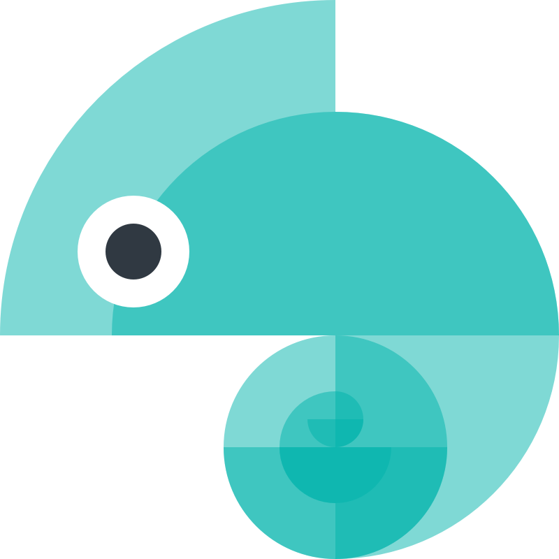

<pre>
<a href="https://styledictionary.com/version-4/migration/">What's new in Style Dictionary 4.0!</a>
</pre>



[](https://badge.fury.io/js/style-dictionary)

[](https://github.com/amzn/style-dictionary/blob/main/CONTRIBUTING.md#submitting-pull-requests)
[](https://github.com/amzn/style-dictionary/actions/workflows/test.yml)
[](https://www.npmjs.com/package/style-dictionary)

# Style Dictionary

> _Style once, use everywhere._

A Style Dictionary uses design tokens to define styles once and use those styles on any platform or language. It provides a single place to create and edit your styles, and exports these tokens to all the places you need - iOS, Android, CSS, JS, HTML, sketch files, style documentation, etc. It is available as a CLI through npm, but can also be used like any normal node module if you want to extend its functionality.

When you are managing user experiences, it can be quite challenging to keep styles consistent and synchronized across multiple development platforms and devices. At the same time, designers, developers, PMs and others must be able to have consistent and up-to-date style documentation to enable effective work and communication. Even then, mistakes inevitably happen and the design may not be implemented accurately. Style Dictionary solves this by automatically generating style definitions across all platforms from a single source - removing roadblocks, errors, and inefficiencies across your workflow.

For detailed usage head to https://amzn.github.io/style-dictionary

## Watch the Demo on YouTube

[](http://youtu.be/1HREvonfqhY)

## Experiment in the playground

Try the browser-based Style Dictionary playground: [https://www.style-dictionary-play.dev/](https://www.style-dictionary-play.dev/), built by the folks at [\<div\>RIOTS](https://divriots.com/).

## Contents

- [Installation](#installation)
- [Usage](#usage)
- [Example](#example)
- [Quick Start](#quick-start)
- [Design Tokens](#design-tokens)
- [Extending](#extending)
- [Contributing](#contributing)
- [License](#license)

## Installation

_Note that you must have node (and npm) installed._

If you want to use the CLI, you can install it globally via npm:

```bash
$ npm install -g style-dictionary
```

Or you can install it like a normal npm dependency. This is a build tool and you are most likely going to want to save it as a dev dependency:

```bash
$ npm install -D style-dictionary
```

If you want to install it with yarn:

```bash
$ yarn add style-dictionary --dev
```

## Usage

### CLI

```bash
$ style-dictionary build
```

Call this in the root directory of your project. The only thing needed is a `config.json` file. There are also arguments:

| Flag                    | Short Flag | Description                                                |
| ----------------------- | ---------- | ---------------------------------------------------------- |
| --config \[path\]       | -c         | Set the config file to use. Must be a .json file           |
| --platform \[platform\] | -p         | Only build a specific platform defined in the config file. |
| --help                  | -h         | Display help content                                       |
| --version               | -v         | Display the version                                        |

### Node

You can also use the style dictionary build system in node if you want to [extend](#extending) the functionality or use it in another build system like Grunt or Gulp.

```javascript
const StyleDictionary = require('style-dictionary').extend('config.json');

StyleDictionary.buildAllPlatforms();
```

The `.extend()` method is an overloaded method that can also take an object with the configuration in the same format as a config.json file.

```javascript
const StyleDictionary = require('style-dictionary').extend({
  source: ['tokens/**/*.json'],
  platforms: {
    scss: {
      transformGroup: 'scss',
      buildPath: 'build/',
      files: [
        {
          destination: 'variables.scss',
          format: 'scss/variables',
        },
      ],
    },
    // ...
  },
});

StyleDictionary.buildAllPlatforms();
```

## Example

[Take a look at some of our examples](examples/)

A style dictionary is a collection of design tokens, key/value pairs that describe stylistic attributes like colors, sizes, icons, motion, etc. A style dictionary defines these design tokens in JSON or Javascript files, and can also include static assets like images and fonts. Here is a basic example of what the package structure can look like:

```
├── config.json
├── tokens/
│   ├── size/
│       ├── font.json
│   ├── color/
│       ├── font.json
│   ...
├── assets/
│   ├── fonts/
│   ├── images/
```

### config.json

This tells the style dictionary build system how and what to build. The default file path is `config.json` or `config.js` in the root of the project, but you can name it whatever you want by passing in the `--config` flag to the [CLI](https://styledictionary.com/getting-started/using_the_cli/).

```json
{
  "source": ["tokens/**/*.json"],
  "platforms": {
    "scss": {
      "transformGroup": "scss",
      "buildPath": "build/",
      "files": [
        {
          "destination": "scss/_variables.scss",
          "format": "scss/variables"
        }
      ]
    },
    "android": {
      "transformGroup": "android",
      "buildPath": "build/android/",
      "files": [
        {
          "destination": "font_dimens.xml",
          "format": "android/fontDimens"
        }
      ]
    }
  }
}
```

| Property                             | Type              | Description                                                                                                                                                                                                                                                                   |
| :----------------------------------- | :---------------- | :---------------------------------------------------------------------------------------------------------------------------------------------------------------------------------------------------------------------------------------------------------------------------- |
| source                               | Array             | An array of file path [globs](https://github.com/isaacs/node-glob) to design token files. Style Dictionary will do a deep merge of all of the token files, allowing you to organize your files files however you want.                                                        |
| include                              | Array             | An array of file path [globs](https://github.com/isaacs/node-glob) to design token files that contain default styles. The Style Dictionary uses this as a base collection of tokens. The tokens found using the "source" attribute will overwrite tokens found using include. |
| platforms                            | Object            | Sets of platform files to be built.                                                                                                                                                                                                                                           |
| platform.transformGroup              | String (optional) | Apply a group of transforms to the tokens, must either define this or `transforms`.                                                                                                                                                                                           |
| platform.transforms                  | Array (optional)  | Transforms to apply sequentially to all tokens. Can be a built-in one or you can create your own.                                                                                                                                                                             |
| platform.buildPath                   | String (optional) | Base path to build the files, must end with a trailing slash.                                                                                                                                                                                                                 |
| platform.files                       | Array (optional)  | Files to be generated for this platform.                                                                                                                                                                                                                                      |
| platform.file.destination            | String (optional) | Location to build the file, will be appended to the buildPath.                                                                                                                                                                                                                |
| platform.file.format                 | String (optional) | Format used to generate the file. Can be a built-in one or you can create your own. [More on formats](https://styledictionary.com/reference/hooks/formats/)                                                                                                                   |
| platform.file.options                | Object (optional) | A set of extra options associated with the file.                                                                                                                                                                                                                              |
| platform.file.options.showFileHeader | Boolean           | If the generated file should have a "Do not edit + Timestamp" header (where the format supports it). By default is "true".                                                                                                                                                    |

### Design Tokens

```json
{
  "size": {
    "font": {
      "small": { "value": "10px" },
      "medium": { "value": "16px" },
      "large": { "value": "24px" },
      "base": { "value": "{size.font.medium.value}" }
    }
  }
}
```

Here we are creating some basic font size design tokens. The style definition size.font.small.value is "10px" for example. The style definition size.font.base.value is automatically aliased to the value found in size.font.medium.value and both of those resolve to "16px".

Now what the style dictionary build system will do with this information is convert it to different formats, enabling these values to be used in any type of codebase. From this one file you can generate any number of files like:

```scss
$size-font-small: 10px;
$size-font-medium: 16px;
$size-font-large: 24px;
$size-font-base: 16px;
```

```xml
<dimen name="font-small">10sp</dimen>
<dimen name="font-medium">16sp</dimen>
<dimen name="font-large">24sp</dimen>
<dimen name="font-base">16sp</dimen>
```

```objc
float const SizeFontSmall = 10.00f;
float const SizeFontMedium = 16.00f;
float const SizeFontLarge = 24.00f;
float const SizeFontBase = 16.00f;
```

## Quick Start

The style dictionary framework comes with some example code to get you started. Install the node module globally, create a directory and `cd` into it.

```bash
$ npm i -g style-dictionary
$ mkdir MyStyleDictionary
$ cd MyStyleDictionary
```

Now run:

```bash
$ style-dictionary init basic
```

This command will copy over the example files found in [example](examples/) in this repo. Now you have an example project set up. You can make changes to the style dictionary and rebuild the project by running:

```bash
$ style-dictionary build
```

Take a look at the documentation for the example code.

## Design Tokens

A design token is an attribute to describe something visually. It is atomic (it cannot be broken down further). Design tokens have a name, a value, and optional attributes or metadata. The name of a token can be anything, but we have a proposed naming structure that we find works really well in the next section.

### Category/Type/Item Structure

While not exactly necessary, we feel this classification structure of design tokens makes the most sense semantically. Design tokens can be organized into a hierarchical tree structure with the top level, category, defining the primitive nature of the token. For example, we have the color category and every token underneath is always a color. As you proceed down the tree to type, item, sub-item, and state, you get more specific about what that color is. Is it a background color, a text color, or a border color? What kind of text color is it? You get the point. Now you can structure your token json files like simple objects:

```json
{
  "size": {
    "font": {
      "base": { "value": "16" },
      "large": { "value": "20" }
    }
  }
}
```

The CTI is implicit in the structure, the category and type is 'size' and 'font', and there are 2 tokens 'base' and 'large'.

Structuring design tokens in this manner gives us consistent naming and accessing of these tokens. You don't need to remember if it is button_color_error or error_button_color, it is color_background_button_error!

You can organize and name your design tokens however you want, there are no restrictions. But we have a good amount of helpers if you do use this structure, like the 'attribute/cti' transform which adds attributes to the token of its CTI based on the path in the object. There are a lot of name transforms as well for when you want a flat structure like for Sass variables.

Also, the CTI structure provides a good mechanism to target transforms for specific kinds of tokens. All of the transforms provided by the framework use the CTI of a token to know if it should be applied. For instance, the 'color/hex' transform only applies to tokens of the category 'color'.

You can also add a _comment_ to a design token:

```json
{
  "size": {
    "font": {
      "base": {
        "value": "16",
        "comment": "the base size of the font"
      },
      "large": {
        "value": "20",
        "comment": "the large size of the font"
      }
    }
  }
}
```

The comment will appear in the output files, where relevant or the output format supports comments.

## Extending

The style dictionary build system is made to be extended. We don't know exactly how everyone will want to use style dictionaries in their project, which is why you can create custom transforms and formats.

```javascript
const StyleDictionary = require('style-dictionary').extend('config.json');

StyleDictionary.registerTransform({
  name: 'time/seconds',
  type: 'value',
  filter: function (token) {
    return token.type === 'time';
  },
  transform: function (token) {
    return (parseInt(token.original.value) / 1000).toString() + 's';
  },
});

StyleDictionary.buildAllPlatforms();
```

For more information on creating your own transforms and formats, take a look at our [docs](https://styledictionary.com).

## Version 4

In May 2021, we started [an issue / RFC, "What would you like to see in Style-Dictionary 4.0?"](https://github.com/amzn/style-dictionary/issues/643) to gather feedback on what the community would like to see.
Fortunately, in August 2023, the folks at [Tokens Studio](https://tokens.studio/) contacted us about co-maintaining this project, and leading the v4 release (and beyond)!

We have started working on the biggest and most important changes, like migrating to ESM, making the library browser-compatible out of the box, and supporting asynchronicity in Style-Dictionary's various APIs. There will be multiple prereleases to battle-test these changes before a final v4.0 is released.

You can follow [this roadmap board](https://github.com/orgs/amzn/projects/4/views/1?layout=board) to keep an eye on the developments for v4.0, we will also keep adding to this board when we encounter changes we'd like to see in v4.0 that would entail a breaking change. Absence of something in this roadmap does not mean we don't see value in it, but rather that it could also be added in a (non-breaking) minor release within v4.x.x.

### From the folks at Tokens Studio

Hi everyone! I'm Joren from Tokens Studio, a big fan of this project (see [Style-Dictionary-Play](https://www.style-dictionary-play.dev/), [Token Configurator](https://configurator.tokens.studio/), [sd-transforms](https://github.com/tokens-studio/sd-transforms)) and the main pusher behind leading a 4.0 release of this project, I think it would be good to explain from our perspective why we've made the move to collaborate with Amazon on this.

At Tokens Studio, we're a huge fan of Design Tokens and the workflows they enable. We believe exporting design tokens to various platforms is a key ingredient in ensuring that the journey from design to implementation code is smooth.
In our minds, Style-Dictionary has been the most popular and most flexible library for reaching that goal, and so we want to build on top of that.
Rather than starting our own spinoff tool, we much prefer bringing Style-Dictionary further, together with its vibrant community of contributors, which is why we reached out to Danny Banks.

I think it's important to stress that it is our shared vision to keep Style-Dictionary as an agnostic (so not "Tokens Studio"-specific) and flexible tool. As Tokens Studio, while we are highly incentivized to see this project progress further to strengthen our product journey, we value the open source community highly and want to make sure this library remains the go-to tool for exporting Design Tokens, whether you use Tokens Studio or not.

We are very open to feedback and collaboration, feel free to reach out to us in [our Slack](https://join.slack.com/t/tokens-studio/shared_invite/zt-1p8ea3m6t-C163oJcN9g3~YZTKRgo2hg) -> `style-dictionary-v4` channel!

## Mascot

The mascot for Style Dictionary is ["Pascal"](https://github.com/amzn/style-dictionary/issues/97) the chameleon (seen below). You can also find them blending in as the logo throughout the documentation.


## Contributing

Please help make this framework better. For more information take a look at [CONTRIBUTING.md](CONTRIBUTING.md)

## License

[Apache 2.0](LICENSE)
