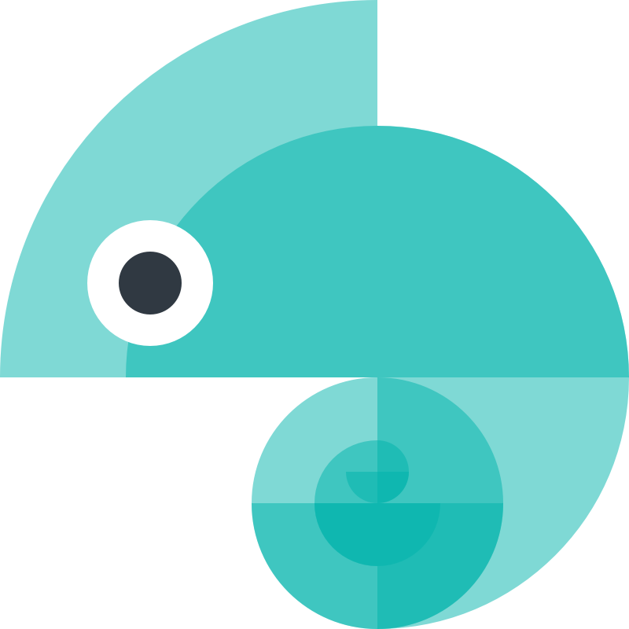

[What's new in Style Dictionary 3.0!](version_3.md)

# Style Dictionary

> _Style once, use everywhere._

A Style Dictionary is a system that allows you to define styles once, in a way for any platform or language to consume. A single place to create and edit your styles, and a single command exports these rules to all the places you need them - iOS, Android, CSS, JS, HTML, sketch files, style documentation, etc. It is available as a [CLI](using_the_cli.md) through npm, but can also be used like any normal [npm module](using_the_npm_module.md) if you want to [extend](extending.md) its functionality.

When you are managing user experiences, it can be quite challenging to keep styles consistent and synchronized across multiple development platforms and devices. At the same time, designers, developers, PMs and others must be able to have consistent and up-to-date style documentation to enable effective work and communication. Even then, mistakes inevitably happen and the design may not be implemented accurately. Style Dictionary solves this by automatically generating style definitions across all platforms from a single source - removing roadblocks, errors, and inefficiencies across your workflow.

## Watch the Demo on Youtube

## Experiment in the playground

Try the browser-based Style Dictionary playground: [https://www.style-dictionary-play.dev/](https://www.style-dictionary-play.dev/), built by the folks at [\<div\>RIOTS](https://divriots.com/).

## Examples

[See examples of Style Dictionary here](examples.md)

## The Basics

**A style dictionary consists of:**

1. [Design tokens](tokens.md), organized in JSON, JSONC, JSON5, or JS files
1. Static assets (e.g. fonts, icons, images, sounds, etc.), organized into folders
1. [Configuration](config.md), defining the [transformation](transforms.md) and [formatting](formats.md) of the tokens and assets for each output platform

**What a style dictionary does:**

1. Transforms design tokens and assets into platform specific deliverables
1. Creates human readable artifacts (e.g. documentation, design libraries, etc)

**Things you can build with a style dictionary:**

1. Styling files for any platform
1. Images and graphics
1. Sketch files
1. Documentation website
1. _Literally anything you want styles or style data in_

**The value of using Style Dictionary to build all of these is that they are all consistent and up to date.**

The Style Dictionary framework is fully extensible and modular. You can create any type of file from a style dictionary. If there is a new language, platform, or file type you need, you can easily [extend](extending.md) the style dictionary framework to create the necessary files.

## Contributing

Please help make this framework better. For more information take a look at [CONTRIBUTING.md](https://github.com/amzn/style-dictionary/blob/main/CONTRIBUTING.md)

## License

[Apache 2.0](https://github.com/amzn/style-dictionary/blob/main/LICENSE)
