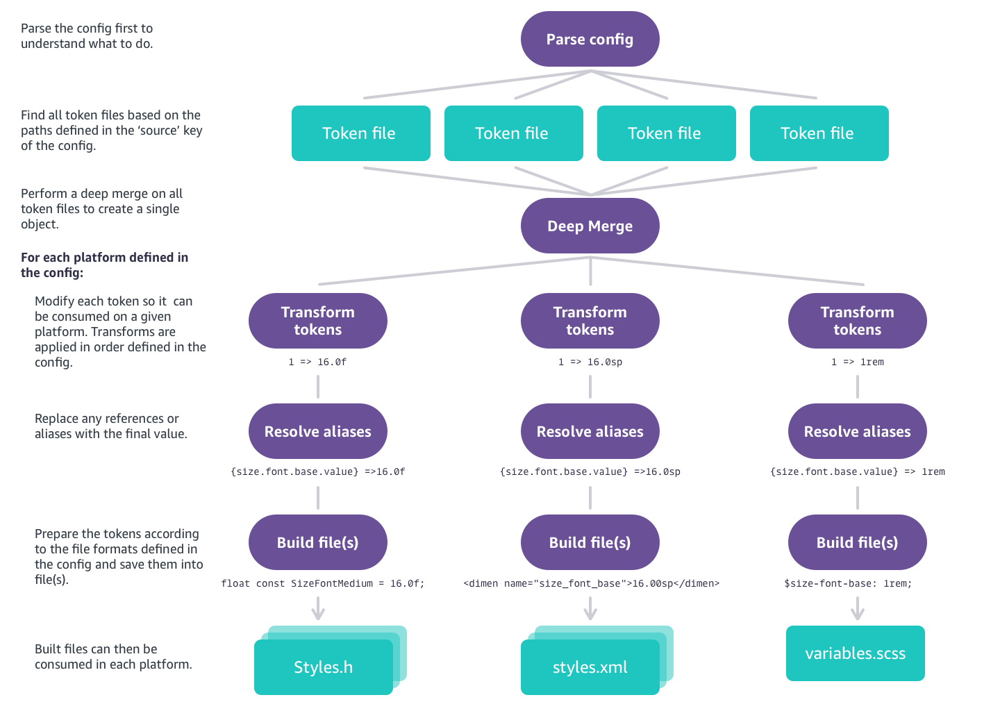

# Build Process

Here is what the build system is doing under the hood.

1. Style Dictionary reads the configuration
1. Find all property files in the `include` attribute, if it is defined in the config, and deep merge them into the `properties` object. If there are [custom parsers](#parsers) defined, Style Dictionary will run those on files the parsers match.
1. Find all the property files in the `source` attribute in the config and performs a deep merge onto the `properties` object. If there are [custom parsers](#parsers) defined, Style Dictionary will run those on files the parsers match.
1. Iterate over the platforms in the config and:
    1. Perform all transforms, in order, defined in the transforms or transformGroup attribute
    1. Build all files defined in the files array
    1. Perform any actions defined in the actions attribute

# How to Build

You can build a style dictionary [using the cli](using_the_cli.md) or [using the npm module](using_the_npm_module.md).

## Parsers

Starting in version 3.0, you can define custom parsers to parse property files. This allws you to define your property files in *any* language you like as long as you can write a parser for it. 

A custom parser matches property files based on a file path regular expression. It will get the contents of a file as a string and should return an object of the data. 

Custom parsers can be used to keep property files in YAML, but they can also be used to add extra metadata onto all properties before transforms are run. 

[Here is an example using YAML property files](https://github.com/amzn/style-dictionary/tree/main/examples/advanced/yaml-tokens)