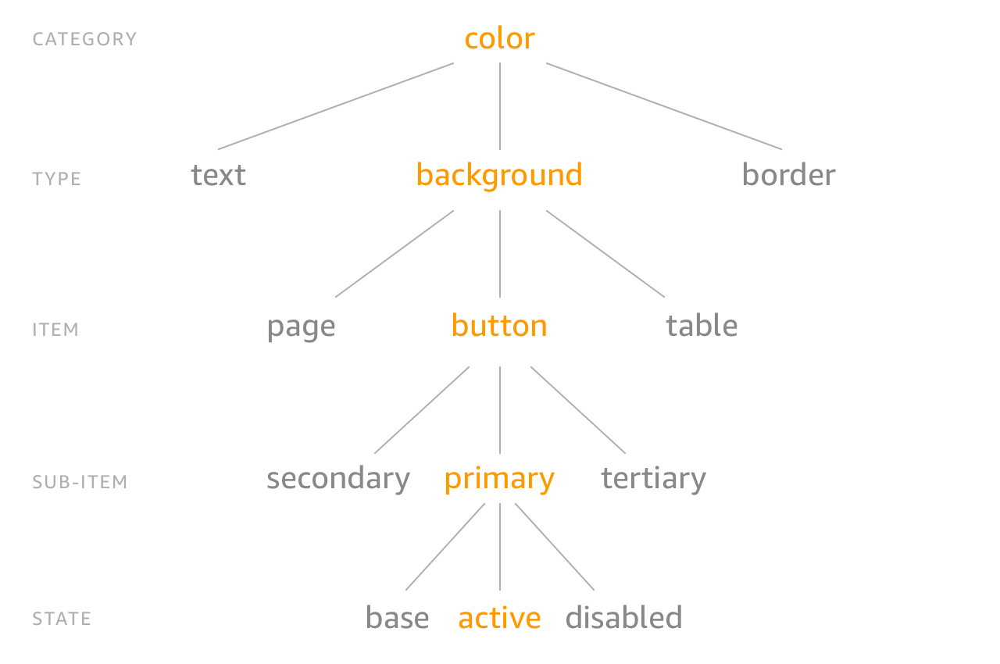

# Package Structure

Style dictionaries are configuration driven.

Here is a basic example of what a style dictionary package looks like.

```
├── config.json
├── properties/
│   ├── size/
│       ├── font.json
│   ├── color/
│       ├── font.json
│   ...
├── assets/
│   ├── fonts/
│   ├── images/
```


## config.json
The default way is to use a config.json file in the root of your package. Here is a quick example:
```json
{
  "source": ["properties/**/*.json"],
  "platforms": {
    "scss": {
      "transformGroup": "scss",
      "prefix": "sd",
      "buildPath": "build/scss/",
      "files": [{
        "destination": "_variables.scss",
        "format": "scss/variables"
      }],
      "actions": ["copy_assets"]
    },
    "android": {
      "transforms": ["attribute/cti", "name/cti/snake", "color/hex", "size/remToSp", "size/remToDp"],
      "buildPath": "build/android/src/main/res/values/",
      "files": [{
        "destination": "style_dictionary_colors.xml",
        "template": "android/colors"
      }]
    }
  }
}
```

| Attribute | Type | Description |
| :--- | :--- | :--- |
| source | Array[String] | An array of paths to JSON files that contain style properties. The Style Dictionary will do a deep merge of all of the JSON files so you can separate your properties into multiple files. |
| platforms | Object | An object containing platform config objects that describe how the Style Dictionary should build for that platform. You can add any arbitrary attributes on this object that will get passed to formats/templates and actions (more on these in a bit). This is useful for things like build paths, name prefixes, variable names, etc.  |
| platform.transforms | Array[String] (optional) | An array of [transforms](transforms.md) to be performed on the style properties object. These will transform the properties in a non-desctructive way so each platform can transform the properties. Transforms to apply sequentially to all properties. Can be a built-in one or you can create your own. |
| platform.transformGroup | String (optional) | A string that maps to an array of transforms. This makes it easier to reference transforms by grouping them together. You must either define this or `transforms`. |
| platform.buildPath | String (optional) | Base path to build the files, must end with a trailing slash. |
| platform.files | Array (optional) | Files to be generated for this platform. |
| platform.file.destination | String (optional) | Location to build the file, will be appended to the buildPath. |
| platform.file.format | String (optional) | [Format](formats.md) used to generate the file. Can be a built-in one or you can create your own. Must declare a format or a template. |
| platform.file.template | String (optional) | [Template](templates.md) used to generate the file. Can be a built-in one or you can create your own. |
| platform.actions | Array[String] (optional) | [Actions](actions.md) to be performed after the files are built for that platform. Actions can be any arbitrary code you want to run like copying files, generating assets, etc. You can use pre-defined actions or create custom actions. |

----

## Properties

Style properties are a collection of JSON files. We usually keep them in a `properties` directory, but you can put them wherever you like,
they just need to be referenced in the `source` attribute on your `config.json` file.

Style properties are what make up a style dictionary. You can structure your properties however you want to, the only requirement is the property contains a "value" attribute. This is how the build system knows which nodes are properties as opposed to structure. This allows you to have different levels of nesting.

```json
{
  "color": {
    "font": {
      "base":  { "value": "#111111" },
      "inverse": {
        "base": { "value": "#EEEEEE" }
      }
    }
  }
}
```

The above JSON snippet has 2 style properties, `color.font.base` and `color.font.inverse.base`. So you can have style properties defined at any level in the JSON structure.

#### Category / Type / Item

This is not required by any means, but we feel this classification structure of style properties makes the most sense semantically. Style properties can be organized into a hierarchical tree structure with the top level, category, defining the primitive nature of the property. For example, we have the color category and every property underneath is always a color. As you proceed down the tree, you get more specific about what that color is. Is it a background color, a text color, or a border color? What kind of text color is it? You get the point. It's like the animal kingdom classification:



Now you can structure your property json files like simple objects:

```json
{
  "size": {
    "font": {
      "base":  { "value": "16" },
      "large": { "value": "20" }
    }
  }
}
```

The CTI is implicit in the structure, the category is 'size' and the type is 'font', and there are 2 properties 'base' and 'large'.

Structuring style properties in this manner gives us consistent naming and accessing of these properties. You don't need to remember if it is button_color_error or error_button_color, it is color_background_button_error!

You can organize and name your style properties however you want, there are no restrictions. But there are a good amount of helpers if you do use this structure, like the 'attribute/cti' transform which adds attributes to the property of its CTI based on the path in the object. There are a lot of name transforms as well for when you want a flat structure like for sass variables.

Also, the CTI structure provides a good mechanism to target transforms for specific kinds of properties. All of the transforms provided by the framework use the CTI structure to know if it should be applied. For instance, the 'color/hex' transform only applies to properties of the category 'color'.

----

## Assets

Assets are not required, but can be useful to include in your style dictionary. If you don't want to manage having assets like images,
vectors, font files, etc. in multiple locations, you can keep them in your style dictionary as a single source of truth.

> Coming soon: how to generate image assets based on your style dictionary
