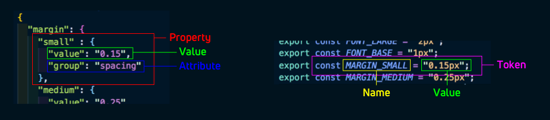

# Properties

> Synonyms: design tokens, design variables, design constants, atoms

Style properties are stored in a collection of JSON or JS module files. We usually keep them in a `properties` directory, but you can put them wherever you like, they need to be referenced in the `source` attribute on your `config.json` file.

A property is a collection of attributes that describe any fundamental/atomic visual style. Each attribute is a `key:value` pair. A property name and its value are considered a design token (or design variable/constant/atom).



A property is transformed for use in different platforms, languages, and contexts. A simple example is color. A color can be represented in many ways, all of these are the same color: `#ffffff`, `rgb(255,255,255)`, `hsl(0,0,1)`.

A property file organizes properties in a structured way for quick access. Property files are organized as a deep object with the leaf nodes being the style key:value pairs.

## Examples

```json
{
  "color": {
    "font": {
      "base": { "value": "#111111" },
      "secondary": { "value": "#333333" },
      "tertiary": { "value": "#666666" },
      "inverse": {
        "base": { "value": "#ffffff" }
      }
    }
  }
}
```

Any object in the JSON that has a `value` attribute on it is a property; in this example there are 4 style properties: `color.font.base`, `color.font.secondary`, `color.font.tertiary`, and `color.font.inverse.base`.

For any properties you wish to output, the "value" attribute is required. This provides the data that will be used throughout the build process (and ultimately used for styling in your deliverables). You can optionally include any custom attributes you would like (e.g. "comment" with a string or "metadata" as an object with its own attributes).

### Example Property
Here you can see a property of "size.font.small" with two attributes:
1. the required "value" attribute, set to "10"
1. the optional "comment" attribute (The "comment" attribute is treated in a special way - the comment will appear in output files when the output format supports comments.)
```json
{
  "size": {
    "font": {
      "small" : {
        "value": "10",
        "comment": "the smallest font allowed for readability"
      },
    }
  }
}
```

### Multiple Properties
Multiple properties in a single file are simple to read and understand using the recommended [`Category / Type / Item (CTI)`](#category-type-item) method
```json
{
  "size": {
    "font": {
      "small" : { "value": "10" },
      "medium": { "value": "16" },
      "large" : { "value": "24" },
    }
  }
}
```

### Attribute reference / alias
You can reference (alias) existing values by using the dot-notation object path (the fully articulated property name) in brackets. Note that this only applies to values; referencing a non-value property will cause unexpected results in your output.
```json
{
  "size": {
    "font": {
      "small" : { "value": "10" },
      "medium": { "value": "16" },
      "large" : { "value": "24" },
      "base"  : { "value": "{size.font.medium.value}" }
    }
  }
}
```
See more in the advanced [referencing-aliasing example](https://github.com/amzn/style-dictionary/tree/master/examples/advanced/referencing_aliasing).

## Category / Type / Item

This CTI structure is not required. However, we feel this classification structure makes the most sense semantically.

Style properties are organized into a hierarchical tree structure with 'category' defining the primitive nature of the property. For example, we have the color category and every property underneath is always a color. As you proceed down the tree, you get more specific about what that color is. Is it a background color, a text color, or a border color? What kind of text color is it? You get the point. It's like the animal kingdom classification:


Now you can structure your property JSON files like simple objects:

```json
{
  "size": {
    "font": {
      "base":  { "value": "16" },
      "large": { "value": "20" }
    }
  }
}
```

The CTI is implicit in the structure, the category is 'size' and the type is 'font', and there are 2 properties 'base' and 'large'.

Structuring style properties in this manner gives us consistent naming and accessing of these properties. You don't need to remember if it is `button_color_error` or `error_button_color`, it is `color_background_button_error`!

You can organize and name your style properties however you want, **there are no restrictions**. But there are a good amount of helpers if you do use this structure, like the 'attribute/cti' transform which adds attributes to the property of its CTI based on the path in the object. There are a lot of names transforms as well for when you want a flat structure like for Sass variables.

Also, the CTI structure provides a good mechanism to target transforms for specific kinds of properties. All of the transforms provided by the framework use the CTI structure to know if it should be applied. For instance, the 'color/hex' transform only applies to properties of the category 'color'.

----
