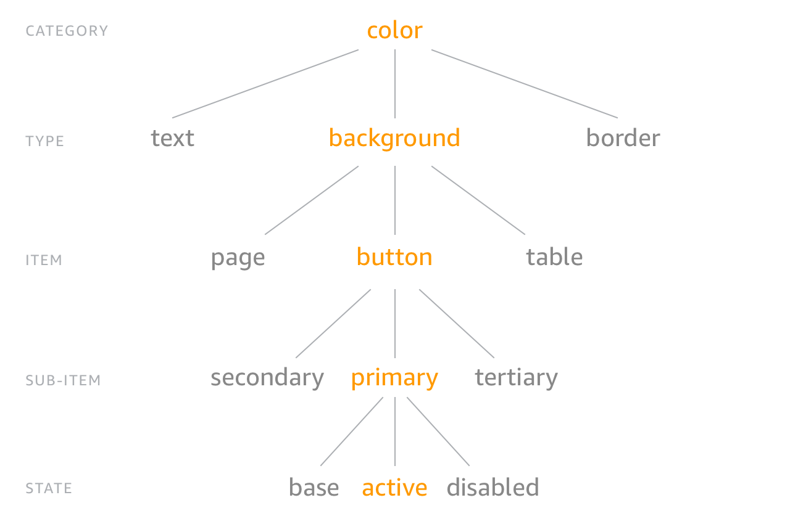

# Properties

> Synonyms: design tokens, design variables, design constants, atoms

Style properties, aka design tokens, are the platform-agnostic way to define the input for Style Dictionary. A property is a collection of attributes that describe any fundamental/atomic visual style. Each attribute is a `key:value` pair. A property name and its value are considered a design token (or design variable/constant/atom).


A property is transformed for use in different platforms, languages, and contexts. A simple example is color. A color can be represented in many ways, all of these are the same color: `#ffffff`, `rgb(255,255,255)`, `hsl(0,0,1)`.

A collection of style properties which are organized in a nested object make the Style Dictionary. Here is an example of style properties:

```json
{
  "color": {
    "font": {
      "base": { "value": "#111111" },
      "secondary": { "value": "#333333" },
      "tertiary": { "value": "#666666" },
      "inverse": {
        "base": { "value": "#ffffff" }
      }
    }
  }
}
```

Any node in the object that has a `value` attribute on it is a property. In this example there are 4 style properties: `color.font.base`, `color.font.secondary`, `color.font.tertiary`, and `color.font.inverse.base`.

## Property attributes

For any properties you wish to output, the "value" attribute is required. This provides the data that will be used throughout the build process (and ultimately used for styling in your deliverables). You can optionally include any custom attributes you would like (e.g. "comment" with a string or "metadata" as an object with its own attributes).

| Attribute | Type | Description |
| :--- | :--- | :--- |
| value | Any | The value of the style property. This can be any type of data, a hex string, an integer, a file path to a file, even an object or array.
| comment | String (optional) | The comment attribute will show up in a code comment in output files if the format supports it.
| themeable | Boolean (optional) | This is used in formats that support override-able or themable values like the `!default` flag in Sass.
| name | String (optional) | Usually the name for a style property is generated with a name transform, but you can write your own if you choose. By default Style Dictionary will add a default name which is the key of the style property object.

You can add any attributes or data you want in a property and Style Dictionary will pass it along to transforms and formats. For example, you could add a `deprecated` flag like in [this example](https://github.com/amzn/style-dictionary/tree/main/examples/advanced/tokens-deprecation). Other things you can do is add documentation information about each property or information about color contrast. 
### Default property metadata

Style Dictionary adds some default metadata on each property that helps with transforms and formats. Here is what Style Dictionary adds onto each property:

| Attribute | Type | Description |
| :--- | :--- | :--- |
| name | String | A default name of the property that is set to the key of the property. This is only added if you do not provide one.
| path | Array[String] | The object path of the property. `color: { background: { primary: { value: "#fff" } } }` will have a path of `['color','background', 'primary']`.
| original | Object | A pristine copy of the original property object. This is to make sure transforms and formats always have the unmodified version of the original property.
| filePath | String | The file path of the file the token is defined in. This file path is derived from the `source` or `include` file path arrays defined in the [configuration](config.md).
| isSource | Boolean | If the token is from a file defined in the `source` array as opposed to `include` in the [configuration](config.md).

Given this configuration:

```json
{
  "source": ["tokens/**/*.json"]
  //...
}
```

This property file:

```json
// tokens/color/background.json
{
  "color": {
    "background": {
      "primary": { "value": "#fff" }
    }
  }
}
```

becomes:

```json
{
  "color": {
    "background": {
      "primary": {
        "name": "primary",
        "value": "#fff",
        "path": ["color","background","primary"],
        "original": {
          "value": "#fff"
        },
        "filePath": "tokens/color/background.json",
        "isSource": true
      }
    }
  }
}
```


### Example Property

Here you can see a property of "size.font.small" with two attributes:

1. The required "value" attribute, set to "10"
1. The optional "comment" attribute (The "comment" attribute is treated in a special way - the comment will appear in output files when the output format supports comments.)

```json
{
  "size": {
    "font": {
      "small" : {
        "value": "10",
        "comment": "the smallest font allowed for readability"
      },
    }
  }
}
```

----

## Referencing / Aliasing

You can reference (alias) existing values by using the dot-notation object path (the fully articulated property name) in curly brackets. Note that this only applies to values; referencing a non-value property will cause unexpected results in your output.

```json
{
  "size": {
    "font": {
      "small" : { "value": "10" },
      "medium": { "value": "16" },
      "large" : { "value": "24" },
      "base"  : { "value": "{size.font.medium.value}" }
    }
  }
}
```

See more in the advanced [referencing-aliasing example](https://github.com/amzn/style-dictionary/tree/master/examples/advanced/referencing_aliasing).


----


```javascript
const StyleDictionary = require('style-dictionary');

StyleDictionary.extend({
  properties: {
    color: {
      background: {
        primary: { value: "#fff" }
      }
    }
  },
  // ...
})
```

```javascript
const StyleDictionary = require('style-dictionary');

StyleDictionary.extend({
  // source is an array of [file path globs](https://www.npmjs.com/package/glob)
  // this says grab all files in the tokens directory with a .json extension
  source: [
    `tokens/**/*.json`
  ]
  // ...
})
```

```javascript
const StyleDictionary = require('style-dictionary');

StyleDictionary.extend({
  include: [
    `node_modules/my-other-style-dictionary/properties.json`
  ],
  source: [
    `tokens/**/*.json`
  ]
  // ...
})
```


----

## Property files

Property files can be written in 

* JSON
* [JSON5](https://json5.org)
* CommonJS modules
* Potentially any language with [custom parsers](#customfileparsers)

Properties can be defined *inline* in the Style Dictionary configuration, or in files. You can add a `properties` object to your Style Dictionary configuration like this:

```javascript
// config.js
module.exports = {
  properties: {
    color: {
      background: {
        primary: { value: "#fff" }
      }
    }
  },
  platforms: {
    //...
  }
}
```

The directory and file structure of property files does not have any effect on the object structure of the properties because Style Dictionary does a deep merge on all property files. Separating properties into files and folders is to make the authoring experience cleaner and more flexible.

### CommonJS modules

One way to write your design token/property files is to write them in Javascript rather than JSON. The only requirement for writing your source files in Javascript is to use a CommonJS module to export a plain object. For example:

```javascript
module.exports = {
  color: {
    base: {
      red: { value: '#ff0000' }
    }
  }
}
```

The above is equivalent to this JSON file:

```json
{
  "color": {
    "base": {
      "red": { "value": "#ff0000" }
    }
  }
}
```

You might prefer authoring your property files in Javascript because it can be a bit more friendly to read and write (don't have to quote keys, can leave dangling commas, etc.). Writing your property files as Javascript gives you more freedom to do complex things like generating many properties based on code. 

```javascript
const Color = require('tinycolor2');

const baseColors = {
  red:    {h: 4,   s: 62, v: 90},
  purple: {h: 262, s: 47, v: 65},
  blue:   {h: 206, s: 70, v: 85},
  teal:   {h: 178, s: 75, v: 80},
  green:  {h: 119, s: 47, v: 73},
  yellow: {h: 45,  s: 70, v: 95},
  orange: {h: 28,  s: 76, v: 98},
  grey:   {h: 240, s: 14, v: 35},
}

// Use a reduce function to take the array of keys in baseColor
// and map them to an object with the same keys.
module.exports = Object.keys(baseColors).reduce((ret, color) => {
  return Object.assign({}, ret, {
    [color]: {
      // generate the shades/tints for each color
      "20":  { value: Color(baseColors[color]).lighten(30).toString()},
      "40":  { value: Color(baseColors[color]).lighten(25).toString()},
      "60":  { value: Color(baseColors[color]).lighten(20).toString()},
      "80":  { value: Color(baseColors[color]).lighten(10).toString()},
      "100": { value: baseColors[color]},
      "120": { value: Color(baseColors[color]).darken(10).toString()},
      "140": { value: Color(baseColors[color]).darken(20).toString()}
    }
  })
}, {});
```

Take a look at the [this example](https://github.com/amzn/style-dictionary/tree/main/examples/advanced/node-modules-as-config-and-properties) if you want to see a more in-depth example of using Javascript files as input.

### Property collision warnings

Style Dictionary takes all the files it finds in the include and source arrays and performs a deep merge on them. It will first add files in the include array, in order, and then the source array in order. Later files will take precedence. If you have 2 files that 

```javascript
const StyleDictionary = require('style-dictionary');
StyleDictionary.extend({
  source: [
    `tokens.json`,
    `tokens2.json`
  ]
})
```

```json5
// tokens.json
{
  "color": {
    "background": {
      "primary": { "value": "#fff" },
      "secondary": { "value": "#ccc" }
    }
  }
}
```

```json5
// tokens2.json
{
  "color": {
    "background": {
      "primary": { "value": "#eee" },
      "tertiary": { "value": "#999" }
    }
  }
}
```

The resulting merged dictionary would be:

```json5
{
  "color": {
    "background": {
      "primary": { "value": "#eee" },
      "secondary": { "value": "#ccc" },
      "tertiary": { "value": "#999" }
    }
  }
}
```

This example would show a warning in the console that you have a collision at `color.background.primary` because 2 source files defined the same property. 

A file in source overriding a file in include will not show a warning because the intent is that you include files you want to potentially override. For example, if you had multiple brands and you wanted to share a default theme, you could include the default theme and then override certain parts.

### Custom file parsers

Starting in 3.0, you can define custom parsers to parse your source files. This allows you to author your property files in other languages like [YAML](https://yaml.org/). Custom parsers run on certain input files based on a file path pattern regular expression (similar to how Webpack loaders work). The parser function gets the contents of the file and is expected to return an object of the data of that file for Style Dictionary to merge with the other input file data.

```javascript
const StyleDictionary = require('style-dictionary');

StyleDictionary.registerParser({
  pattern: /.json$/,
  parse: ({contents, filePath}) => {
    return JSON.parse(contents);
  }
});
```

[Here is a complete custom file parser example](https://github.com/amzn/style-dictionary/tree/main/examples/advanced/custom-parser)

[yaml-tokens example](https://github.com/amzn/style-dictionary/tree/main/examples/advanced/yaml-tokens)


## Property structure

You are free to structure your Style Dictionary however you wish. You could have a flat object rather than a nested one:

```json
{
  "colorBackgroundPrimary": { "value": "#fff" },
  "sizePaddingLarge": { "value": 4 }
}
```

### Category / Type / Item

**This structure is not required.** This is just one example of how to structure your style properties.

Style properties are organized into a hierarchical tree structure with 'category' defining the primitive nature of the property. For example, we have the color category and every property underneath is always a color. As you proceed down the tree, you get more specific about what that color is. Is it a background color, a text color, or a border color? What kind of text color is it? You get the point. It's like the animal kingdom classification:



Now you can structure your properties in a nested object like this:

```json
{
  "size": {
    "font": {
      "base":  { "value": "16" },
      "large": { "value": "20" }
    }
  }
}
```

The CTI is implicit in the structure, the category is 'size' and the type is 'font', and there are 2 properties 'base' and 'large'.

Structuring style properties in this manner gives us consistent naming and accessing of these properties. You don't need to remember if it is `button_color_error` or `error_button_color`, it is `color_background_button_error`!

You can organize and name your style properties however you want, **there are no restrictions**. But there are a good amount of helpers if you do use this structure, like the 'attribute/cti' transform which adds attributes to the property of its CTI based on the path in the object. There are a lot of names transforms as well for when you want a flat structure like for Sass variables.

Also, the CTI structure provides a good mechanism to target transforms for specific kinds of properties. All of the transforms provided by the framework use the CTI structure to know if it should be applied. For instance, the 'color/hex' transform only applies to properties of the category 'color'.

Here are the categories and types the built-in transforms and formats use:

* color: everything under this category is a color. You can further organize by background, font, border, etc. The built-ins only look for a category of `color`
* size: for most platforms any type of size is treated the same. On Android it is common to use SP for font sizes and DP for paddings and dimensions. 
    * font
    * icon (icon and font types in the size category are important for distinguishing between using DP and SP units in Android)
    * padding
* border
* asset (used for images and font files)
* content (used for strings)
    * icon (this is assuming you are using an icon font with specific unicode characters)
