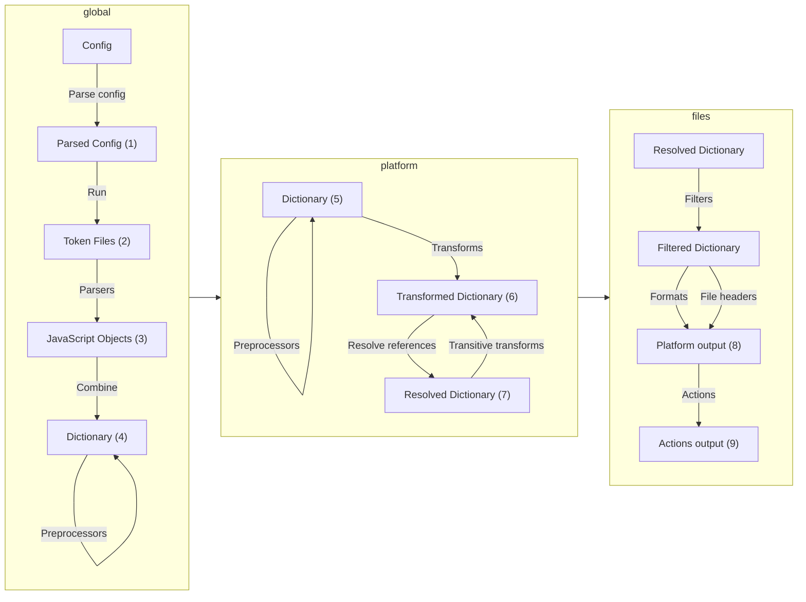

This is how Style Dictionary works under the hood:

Let's take a closer look into each of these steps.

## 1. Parse the config

Style Dictionary is a configuration based framework, you tell it what to do in a configuration file. Style Dictionary first parses this [configuration](/reference/config) to know what to do.

## 2. Find all token files

In your [config](/reference/config) file can define `include` and `source`, which are arrays of file path globs. These tell Style Dictionary where to find your token files. You can have them anywhere and in any folder structure as long as you tell Style Dictionary where to find them.

## 3. Parse token files

If there are [custom parsers](/reference/hooks/parsers) defined and applied in the config, Style Dictionary will run those on files the applied parsers match. For JSON or JavaScript token files, those are parsed automatically through built-in parsers.

## 4. Deep merge token files

Style Dictionary takes all the files it found and performs a deep merge. This allows you to split your token files in any way you like, without worrying about accidentally overriding groups of tokens. This gives Style Dictionary a single, complete token object to work from.

## 5. Run preprocessors over the dictionary

Allows users to configure [custom preprocessors](/reference/hooks/preprocessors), to process the merged dictionary as a whole, rather than per token file individually.
These preprocessors have to be applied in the config, either on a global or platform level.
Platform level preprocessors run once you get/export/format/build a platform, at the very start.
Note that [tokens expansion](/reference/config#expand) runs after the user-configured preprocessors (for both global vs platform configured, respectively).

## 6. Transform the tokens

Style Dictionary now traverses over the whole token object and looks for design tokens. It does this by looking for anything with a `value` key. When it comes across a design token, it then performs all the [transforms](/reference/hooks/transforms) defined in your [config](/reference/config) in order.

Value transforms, transforms that modify a token's value, are skipped if the token references another token. Starting in 3.0, you can define a [transitive transform](/reference/hooks/transforms#transitive-transforms) that will transform a value that references another token after that reference has been resolved.

## 7. Resolve aliases / references to other values

After all the tokens have been transformed, it then does another pass over the token object looking for aliases, which look like `"{size.font.base}"`. When it finds these, it then replaces the reference with the transformed value. Because Style Dictionary merges all token files into a single object, aliases can be in any token file and still work.

## 8. Format the tokens into files

Now all the design tokens are ready to be written to a file. Style Dictionary takes the whole transformed and resolved token object and for each file defined in the platform it [formats](/reference/hooks/formats) the token object and write the output to a file. Internally, Style Dictionary creates a flat array of all the design tokens it finds in addition to the token object. This is how you can output a flat SCSS variables file.

## 9. Run actions

[Actions](/reference/hooks/actions) are custom code that run in a platform after the files are generated. They are useful for things like copying assets to specific build directories or generating images.

After Style Dictionary does steps 4a-4d for each platform, you will have all your output files that are ready to consume in each platform and codebase.
