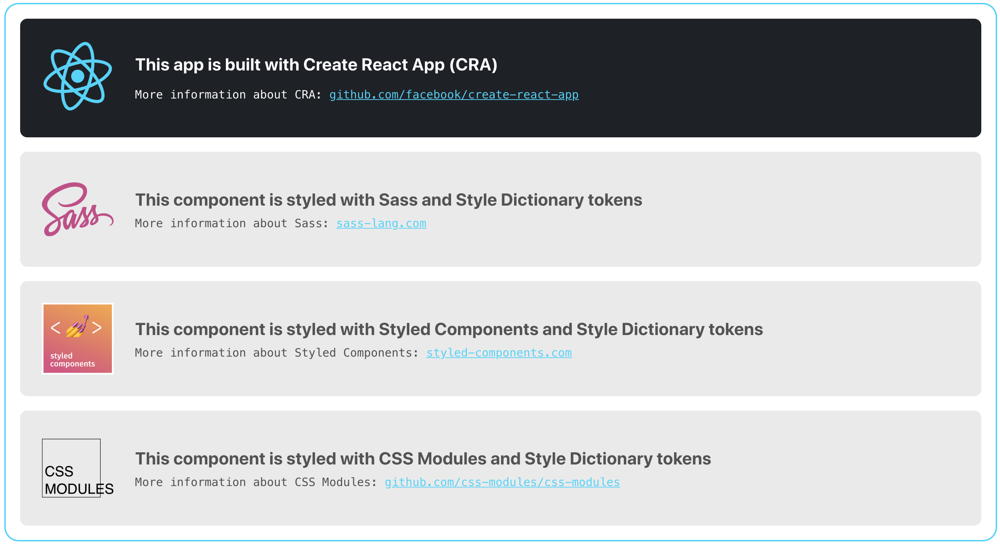

## How to consume Style Dictionary properties in React

This example shows how to consume design tokens, generated via Style Dictionary, in a React application. 

To setup the app we have used [Create React App](https://facebook.github.io/create-react-app/) (CRA); we then have added to the default page three similar components, styled via [Sass](http://sass-lang.com/), [CSS Modules](https://github.com/css-modules/css-modules) and [Styled Components](https://www.styled-components.com). The CSS for these three different stylings is consuming the same set of tokens generated from design properties.

#### Running the example

First of all, set up the required dependencies running the command `npm install` in your local CLI environment (if you prefer to use *yarn*, update the commands accordingly).

At this point, if you want to build the tokens and launch the React application, you can run `npm run start`. This command will first generate the tokens files, then compile the React application, and finally launch the local web server and open the application in a browser window.

This is what you should see:



If instead you want to build the tokens only, you can run `npm run build-dictionary`. This command will generate the files in the `src/style-dictionary-dist` folder, inside the CRA source folder.

**Important**: the file `.env` in this folder is to have CRA run inside another project; if want to use this example as standalone codebase please remove it.


#### What to look at

In the **`style-dictionary`** folder you can find the properties files (`color/font/spacing.json`) and the configuration file (`config.json`) used by Style Dictionary to build the design tokens.

In the **`src`** folder you can find the source files of the React application created via CRA. These files have been modified and updated to contain three different examples of components, each one styled in a different way, but all consuming the same set of tokens.

The file **`App.js`** is the main app file. You can see the three component in the code:

```
<main>
    <ComponentWithSass />
    <ComponentWithStyledComponents />
    <ComponentWithCssModules />
</main>
```

The folder `components` contains the code for the three components used in the app:

- The **`components/with-sass`** folder contains the example React component, styled using CSS/Sass. Look at how the design tokens are consumed inside the Sass file as Sass variables. The Sass file is then imported in the component which will be compiled to CSS at build time and included in the resulting web app page.

- The **`components/with-css-modules`** folder contains the example React component, styled using CSS Modules. Look at how the styles are imported in the component, and the class names are applied to the HTML elements. The CSS styles are declared in Sass by which the design tokens can be consumed directly as Sass variables.<br>*If you want to know more about how CSS Modules works with React, and how it applies CSS styles to the JSX elements, [please refer to the documentation](https://github.com/css-modules/css-modules/blob/master/docs/css-modules-with-react.md).*

* The **`components/with-styled-components`** folder contains the example React component, styled using Styled Components. Look at how in this case the styles are declared directly in the component, as template literal "objects", and how the design tokens are consumed as JavaScript variables.<br>*If you want to know more about how Styled Components works, and how it applies CSS styles to the HTML elements, [please refer to the documentation](https://www.styled-components.com/docs/basics#getting-started).*

--


### Some useful links

- [Official documentation for Create React App](https://github.com/facebook/create-react-app)
- [How to use Sass and CSS Modules with create-react-app
](https://blog.bitsrc.io/how-to-use-sass-and-css-modules-with-create-react-app-83fa8b805e5e)
- [CSS Modules and create-react-app](https://www.robinwieruch.de/create-react-app-css-modules/)
- [Getting started with Styled Components and Create React App](https://medium.com/styled-components/styled-components-getting-started-c9818acbcbbd)
- [How do I use styled-components with create-react-app?](https://www.styled-components.com/docs/faqs#how-do-i-use-styledcomponents-with-createreactapp)
