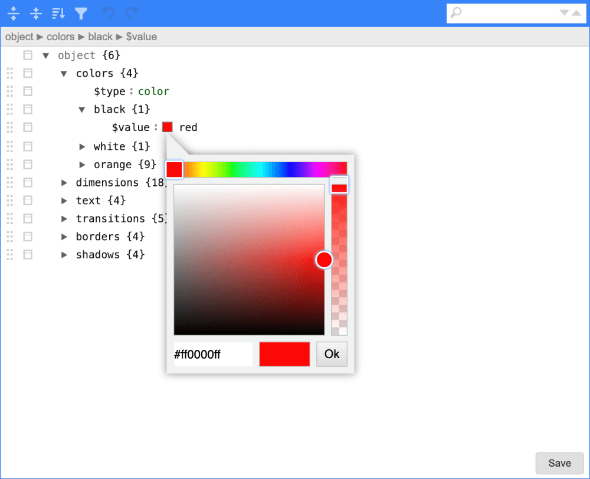

# Tokens GUI

This example shows how to use [jsoneditor-cli](https://github.com/artursopelnik/jsoneditor-cli) to load tokens from [style-dictionary](https://amzn.github.io/style-dictionary/) into a GUI.

#### Running the example

First of all, set up the required dependencies running the command `npm install` in your local CLI environment (if you prefer to use _yarn_ update the commands accordingly).

At this point, if you want to start you can run `npm start`. This command will start jsoneditor webapp.
